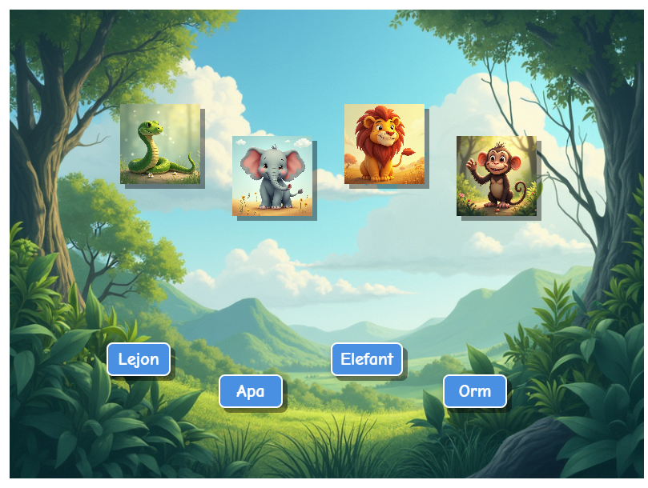

# Game for kids. Learn to read by word-image association. 

<!-- Last deployed: 2024-04-15 10:30 -->

## Description
This is a simple web game where the player uses drag and drop to match text-boxes with pictures. The game can be customized with for example pictures of family, friends, pets etc. See the file config.txt. The current "games" are in Swedish but there is no language dependency per se. The code is more or less completely written by Cursor, so if it looks messy, don't blame me. It will not run well in all mobile browsers due to screen size issue.  

Example, screen-shot:

## How to Run
Visit https://berndtjohannsen.github.io/gameDragDrop/ (not sure it always will be running). Or download the files locally and point to index.html (requires Internet access and a web server)

## Some Files/directories
- `pictures/`: Directory containing images for each "game".
- `sounds/`: Directory containing sound effects for each "game".
- config.txt: Configuration and instructions for creating your own "game" by  adding images and sounds

## License
Pretty tolerant for all use. See the license file, if you have any concerns, contact me.
